*Defensive Publication*

# Printed-Circuit-Board Linear-Motor XY Translation Stage for Microscopy

Authors: Jeff McBride, Benedict Diederich

Affiliation: **JEFF'S company** / openUC2 GmbH (and independent contributors)

Contact: benedictdied@gmail.com

*Document version: 0.1 (draft) — Publication date: **XXXXXX***

**— PURPOSE OF THIS DOCUMENT —**

*This document is a defensive publication. It is intended to be made publicly available — for example, on Technical Disclosure Commons, on Zenodo (with a citable DOI), and/or in a public GitHub repository — so that the technical subject matter it discloses becomes prior art as of its publication date. Its purpose is NOT to reserve patent rights for the authors. Its purpose is to prevent any third party from later obtaining a patent that would block the authors, the openUC2 community, or the wider scientific community from practicing the technology described herein, or any obvious variant of it.*

*The authors release the technical content of this document under the Creative Commons Attribution 4.0 International licence (CC BY 4.0 **THIS IS YET TO BE DECIDED - I'M NOT REALLY AN EXPERT HERE..**). Any associated source code, hardware design files, and firmware are released under their respective open-source licences as published by openUC2. This document does not, and is not intended to, grant a licence to any patent owned or controlled by the authors or by **JEFFS COMPANY** or openUC2 GmbH; the authors expressly reserve the right to apply for patents on subject matter that is not disclosed herein.*

# TODOs:

- 9.3.12 etc not needed 
- Remove 8.3
- Reduce specificity on driver side
- Glass Plate as substratte
- Add Z-mechanism / springloaded to have electromagnetically induced z-stacking 

 

# **1. Abstract**

Disclosed herein is an XY translation stage for optical microscopy in which the actuator is implemented entirely as a multi-layer printed circuit board (PCB). Patterned copper traces on two or more layers of the PCB form a two-dimensional electromagnetic drive structure analogous to an unrolled, planar, two-axis stepper motor. A carriage (also referred to as a "sled") carrying a microscopy sample is provided with one or more permanent magnets, and is translated in the X and Y directions in the plane of the PCB by phase-shifted currents flowing through the patterned copper traces. The PCB may include one or more apertures permitting transmitted illumination, epi-illumination, or hybrid illumination geometries, so that the same stage can be used in upright, inverted, brightfield, fluorescence, darkfield, and phase-contrast configurations. The carriage may interface with the PCB via a low-friction film, glass, a dry or fluid lubricant, rolling elements, or a pressurised air film formed by an array of micro-apertures in the PCB. Position feedback may be obtained from images captured through the microscope objective, from dedicated optical encoders, from Hall, magnetoresistive, capacitive, or inductive sensors, from time-of-flight or interferometric devices, or from any combination of these. The PCB stator may be partitioned into multiple electrically independent segments or tiles, of which only the segments under or adjacent to the carriage are energised, so as to reduce power consumption and so as to permit straightforward scaling to arbitrarily large travel areas by physical or logical tiling. A specific four-channel bipolar constant-current driver, controllable over USB-C and CAN-FD, is also disclosed. (**UNSURE IF THE DRIVER IS REALLY NECESSARY- rather common knowledge already?**)

# **2. Technical Field**

This disclosure relates to precision motion systems and, more particularly, to low-profile, planar XY translation stages for optical microscopy that use distributed electromagnetic actuation implemented in a printed circuit board, in combination with a magnetic carriage that holds a microscopy sample.

# **3. Background and Prior Art**

## **3.1 Conventional microscopy stages**

Conventional XY translation stages used in optical microscopy generally rely on stacked mechanical assemblies built from leadscrews, belts, ballscrews, or linear rails, each driven by a separate rotary motor. Such stages add significant height above and below the sample plane, increase optical and mechanical complexity, and typically introduce parasitic pitch, yaw, and Z-drift during scanning. Their mass and footprint scale poorly with travel range. They are also expensive: a typical motorised microscopy stage with several centimetres of travel and sub-micron resolution costs in the thousands of euros, and the cost grows rapidly with travel range.

For applications such as portable diagnostics, field microscopy, automated whole-slide imaging, and large-area lab automation, there is a need for stages that are flatter, cheaper, scalable to large travel areas, manufacturable using standard PCB-fabrication processes, and naturally compatible with both upright and inverted optical paths.

## **3.2 PCB linear motors and the prior art the present disclosure builds on**

The use of patterned copper traces in a printed circuit board to form the stator of a linear electromagnetic motor — together with a moving permanent-magnet carriage — has been publicly demonstrated and documented prior to the date of this disclosure. The authors expressly acknowledge the following prior art and consider it part of the public domain on which the present disclosure builds:

- Kevin Lynagh, "PCB Stepper" (2022), publicly available at https://kevinlynagh.com/pcb-stepper/, which describes the use of orthogonal copper traces on a PCB to translate a small permanent magnet in two dimensions across a planar grid by means of bipolar phase currents.

- Jeff McBride, "The Gauss Speedway" (November 2022), publicly available at https://jeffmcbride.net/gauss-speedway/, which describes a closed-loop racetrack-shaped PCB linear motor with bipolar two-phase drive, lateral guard-trace centring forces, an LC-filtered constant-current driver topology, and a four-layer PCB stack that places drive traces close to the magnetic carriage. The same author has separately documented, in "KiCad Magnet Racetrack Layout with Python Plugin" (https://jeffmcbride.net/kicad-track-layout/) and the related CurvyCad project, the programmatic generation of curved trace patterns and via arrays in a KiCad PCB by means of a Python action plugin.

The present disclosure is published in part to make absolutely clear that the underlying physical principle — translating a permanent-magnet carriage by means of phase-driven copper traces in a PCB — is, as of the date of this publication, in the public domain. No party should be permitted to obtain a patent monopoly on that principle, on its application to microscopy, or on the obvious variants and combinations described in this document.

## **3.3 What this disclosure adds**

The present disclosure extends the publicly known PCB linear motor concept to the specific application of optical microscopy stages. The features that this disclosure makes public, and that are intended to be considered prior art against any future patent application by any third party, include in particular (without limitation):

- integration of one or more apertures in the PCB stator to permit transmitted illumination, epi-illumination, fluorescence excitation, and inverted imaging through the same stator;

- the use of the inherent flatness of the PCB substrate as the primary Z reference for the sample plane, eliminating the focus-drift typically associated with stacked mechanical stages;

- image-based closed-loop position feedback obtained from images captured through the microscope objective itself, optionally combined with printed fiducials, sample features, or carriage-mounted patterns;

- a magnet arrangement on the carriage in which the magnet pitch is matched to the trace grid pitch by a factor of √2 and the magnet array is rotated 45° relative to the orthogonal X/Y trace grid, so that a single magnet array couples efficiently to both axes;

- segmentation of the PCB stator into multiple electrically independent tiles, of which only those under or near the carriage are energised, allowing the active travel area to be scaled to arbitrary size;

- the use of an air-film bearing formed by a distributed array of micro-apertures (drilled holes, vias, milled slots, or laser-processed openings) in the PCB itself, optionally zoned and actively controlled, to provide a near-zero-friction interface between the carriage and the PCB stator and, optionally, to provide active cooling;

- a four-channel, bipolar, constant-current driver topology with on-board CAN-FD and USB-C interfaces, suitable for driving two orthogonal X/Y phase pairs from a single small controller board, as embodied in the openUC2 "QuadDriver" reference design;

- the carriage as an integration platform that may carry, in addition to the sample, one or more of: an inductive power/data coupling element, on-board sensors, integrated illumination (LED or laser), printed fiducials, calibration patterns, or active temperature control;

- the use of the PCB silkscreen layer or an additional printed layer as a fluorescent or scintillation reference for calibration, focus, or excitation-channel verification;

- compensation of stick-slip and lateral disturbance via calibrated impulse-response feedforward, adaptive guard-trace currents, and/or small high-frequency dither superimposed on the drive currents.

The authors do not claim, and have not previously claimed, any of the items in section 3.2 (the underlying PCB-linear-motor concept). The authors disclose the items in section 3.3, and all of the embodiments and variants in sections 4 through 12 below, as prior art effective from the publication date of this document.

 

# **4\. Brief Description of the Figures**

FIG. 1 illustrates the overall arrangement of a PCB linear-motor XY translation stage for microscopy in both an upright transmission geometry (panel A) and an inverted / epi-illumination geometry (panel B).

FIG. 2 is a cross-sectional view, vertically exaggerated for clarity, of a four-layer PCB stator with a permanent-magnet carriage above it, showing the layer stack-up, the friction interface, and the spatial relationship between the magnet array and the phase traces; insets show one period of the X-phase A / X-phase B trace pair and the corresponding sinusoidal drive waveforms.

FIG. 3 is a top view of a segment of the PCB stator showing the orthogonal X-phase and Y-phase trace sets on different layers, the perimeter guard traces, and the 45°-rotated 2D magnet array.

FIG. 4 illustrates four alternative carriage magnet arrangements: (A) a simple alternating N/S array, (B) a linear Halbach array, (C) a 2D arrangement with √2-pitch matched to the trace grid and rotated 45°, and (D) an electromagnet variant.

FIG. 5 illustrates six alternative friction-reduction interfaces between the carriage and the PCB stator: (A) low-adhesion film, (B) boundary lubricant or oil, (C) rolling elements, (D) air-film bearing formed by micro-apertures in the PCB, (E) active vibration / dither, and (F) compliant deformable contact ("flat-tire" feet).

FIG. 6 is a block diagram of a closed-loop control architecture with image-based position feedback obtained through the microscope objective, and a non-exhaustive list of alternative or supplementary feedback sources.

FIG. 7 illustrates a segmented / tiled PCB stator architecture in which only the tile or tiles under or adjacent to the carriage are energised, with each tile carrying its own local current driver and being addressed over a multi-drop bus (CAN-FD shown).

FIG. 8 is a block diagram of a four-channel bipolar current-driver controller board (the "QuadDriver"), based on an STM32G474 microcontroller, four DGD0506A half-bridge gate drivers, four pairs of SI2318A N-channel MOSFETs, four output LC filters, four shunt-resistor current-sense paths, an MCP2542 CAN-FD physical layer, and a USB-C interface.

FIG. 9 is a schematic of a single bipolar current-driver channel, of which four instances are present on the controller board of FIG. 8\.

FIG. 10 illustrates four representative microscopy sample configurations supported by the same PCB stator merely by changing the carriage adapter: (A) a glass-slide blood smear, (B) a fecal/parasitology smear, (C) a multi-well plate, and (D) a microfluidic chip.

 

# **5\. Detailed Description**

## **5.1 Overall arrangement**

In one embodiment, with reference to FIG. 1, an XY translation stage for optical microscopy comprises a planar actuator substrate (140) in the form of a multi-layer printed circuit board carrying patterned copper traces on at least two of its conductive layers; a carriage (120), also referred to herein as a sled, configured to support a microscopy sample; a magnet assembly (130) coupled to the carriage and arranged to interact with the magnetic field produced by currents flowing in the patterned copper traces, so as to generate forces translating the carriage in an X direction and a Y direction in the plane of the PCB; and an optical detection system, typically comprising a microscope objective (110) and a camera, arranged on one side of the PCB and aligned with one or more apertures (150) in the PCB, so that the sample carried by the carriage can be imaged by the optical detection system while the carriage is translated relative to the optical detection system. An illuminator (160) is arranged on the same side as the objective (epi-illumination, FIG. 1B), on the opposite side (transmitted illumination, FIG. 1A), or in a hybrid configuration in which excitation and detection enter through different apertures.

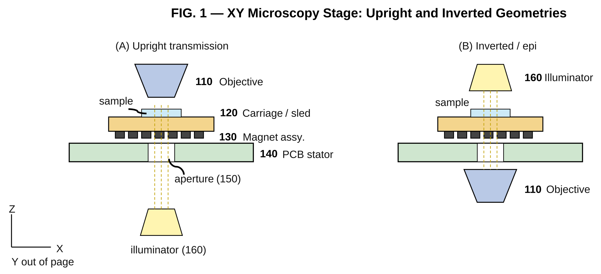

*FIG. 1 — XY microscopy stage in upright (A) and inverted (B) configurations.*

The drive structure is conceptually equivalent to a planar, distributed, two-axis stepper motor whose stator has been "unrolled" into a single flat sheet. By energising the trace sets with time-varying, optionally bipolar, currents, a traveling magnetic field is produced that exerts Lorentz-force-mediated and field-gradient-mediated forces on the carriage magnet assembly, thereby translating the carriage in a controlled and continuous manner. Because the drive structure is implemented using only standard printed-circuit-board fabrication processes, the cost per unit area of the active stage scales approximately as the cost per unit area of an ordinary multi-layer PCB, which is dramatically lower than the cost per unit area of conventional linear-rail or leadscrew stages.

## **5.2 PCB stator and electromagnetic drive structure**

### **5.2.1 Layer stack-up**

With reference to FIG. 2, in one embodiment the PCB stator (140) is a four-layer board comprising, from the side facing the carriage to the opposite side: a top conductive layer (141) carrying X-axis phase traces; a first dielectric layer (144), typically of prepreg; a second conductive layer (142) carrying Y-axis phase traces; a dielectric core; a third conductive layer (143) carrying control-signal routing and, optionally, low-current return paths; and a fourth conductive layer (145) serving as ground and electromagnetic shield. The X-axis trace layer (141) is preferably placed within approximately 0.5 mm of the surface (170) facing the magnet assembly (130), so as to maximise the magnetic coupling per ampere of drive current. In other embodiments the PCB has six, eight, or more layers; the X- and Y-axis trace sets may be split across multiple layers to permit higher current density without locally exceeding the manufacturer's copper-thickness limits; and additional internal layers may be used for orthogonal guard traces, for shielding, or for routing power and signals into the interior of the active area without crossing the actuator copper.

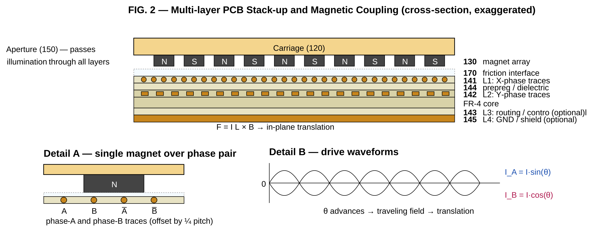

*FIG. 2 — Multi-layer PCB stack-up and magnetic coupling (cross-section, vertically exaggerated).*

### **5.2.2 Trace sets and phases**

With reference to FIG. 3, the PCB stator carries at least two electrical phases per axis. The X-axis comprises a Phase A trace set and a Phase B trace set, the two sets being spatially offset along Y by a fraction of the trace pitch (typically one quarter of the period) so that, when driven with phase-shifted currents I\_A \= I·sin(θ) and I\_B \= I·cos(θ), the combined field exerts a smoothly varying force on the carriage magnet array as the electrical angle θ advances. The Y-axis comprises a Phase A trace set and a Phase B trace set arranged orthogonally to the X-axis traces, on a different conductive layer of the PCB. In other embodiments, more than two phases per axis are used (for example three-phase drive) so as to reduce torque ripple, smooth motion further, and reduce audible noise.

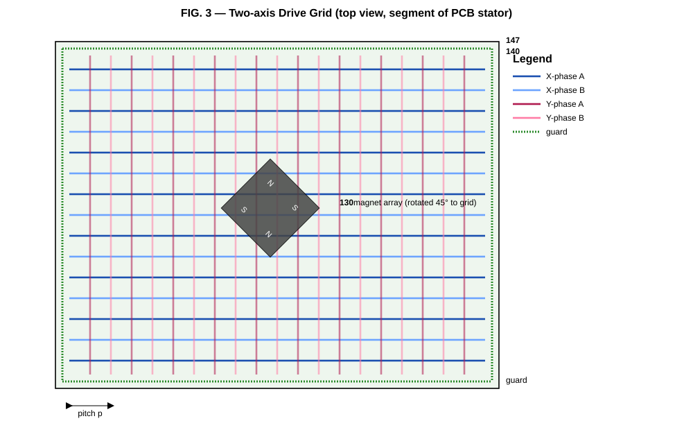

*FIG. 3 — Top view of the two-axis PCB drive grid with X-, Y-, and guard traces.*

The trace pattern is preferably periodic along the direction of motion, with a pitch chosen to match the periodicity of the carriage magnet array. In a representative embodiment, the trace pitch is in the range from approximately 1 mm to approximately 10 mm; the trace width is in the range from approximately 0.15 mm to approximately 1.5 mm; the trace spacing is selected to satisfy the manufacturer's minimum-clearance rules at the operating voltage; and the magnet pitch on the carriage is set equal to the trace pitch, or to an integer or half-integer multiple thereof, so as to maximise the force per ampere. The exact selection of pitch, width, and spacing for any particular application is a routine engineering optimisation that depends on the available drive voltage, the maximum permissible copper temperature rise, the desired peak force, the choice of magnets, and the air gap; the present disclosure expressly contemplates all such routine optimisations as falling within its scope.

### **5.2.3 Programmatic trace generation**

The trace pattern is preferably generated programmatically, for example by means of a Python script that drives a PCB-design tool such as KiCad through its scripting interface, so as to produce arbitrarily long periodic patterns, smooth arcs, straight segments, and tiled grids while maintaining electrical connectivity, consistent pitch, and design-rule compliance. Such programmatic generation has been publicly described in connection with the prior-art racetrack motors referenced in section 3.2, and any analogous automation for the present microscopy stage falls within the scope of the present disclosure.

### **5.2.4 Guard or centring traces**

The PCB stator may further include one or more guard trace sets (147) positioned laterally with respect to the intended path of motion of the carriage. When energised, the guard traces generate restoring forces that bias the carriage toward a desired centreline, and thereby reduce lateral deviation during fast scanning, around curves, and during arbitrary trajectories. Guard traces may be driven continuously, may be driven with a current adapted in real time to a measured lateral displacement of the carriage, or may be selectively energised only when the carriage is approaching a region in which lateral discipline is required. In an embodiment in which several guard rails are provided at different lateral positions along the carriage, independent currents in each guard rail may be used to control both lateral translation and yaw of the carriage. The use of guard traces for stage centring as disclosed herein is contemplated as a microscopy-stage embodiment of the more general guard-rail concept previously published in connection with the prior-art racetrack motors.

## **5.3 Carriage and magnet assembly**

### **5.3.1 Permanent magnet arrangements**

With reference to FIG. 4, the carriage (120) carries a magnet assembly (130) which, in a first embodiment (FIG. 4A), comprises a one-dimensional array of permanent magnets of alternating polarity. In a preferred embodiment (FIG. 4B), the magnets are arranged in a linear Halbach configuration, in which the magnetisation direction of each magnet is rotated by 90° relative to its neighbours so that the magnetic field is augmented on the side of the array facing the PCB stator and is largely cancelled on the opposite side facing the sample. The Halbach configuration provides several simultaneous advantages: it increases force per ampere of drive current by a factor of approximately √2 relative to a simple alternating array of equal mass; it reduces stray fields above the sample plane that might otherwise interfere with sensitive samples or with nearby electronics; and it reduces parasitic torque on the carriage that would otherwise tend to induce pitch or yaw motion.

*FIG. 4 — Carriage magnet arrangements: (A) alternating, (B) linear Halbach, (C) 2D √2-pitch matched array, (D) electromagnet variant.*

In a further embodiment (FIG. 4C), the magnet assembly comprises a two-dimensional array of permanent magnets in which the inter-magnet spacing is set to √2 times the pitch of the orthogonal X- and Y-trace grid of the PCB stator, and the entire magnet array is rotated by 45° relative to the trace grid. With this arrangement, a single magnet array couples efficiently to both the X-phase and Y-phase trace sets simultaneously, allowing decoupled commutation of the two axes from a single carriage. In other embodiments, the magnet rotation angle is chosen to be other than 45° so as to optimise force in a particular direction, or to support unipolar, bipolar, or multi-phase operation as desired. Magnet shapes contemplated by the disclosure include cylindrical, rectangular, cubic, ring, segmented, and bonded shapes; magnet materials contemplated include neodymium-iron-boron (NdFeB) of any commercially available grade, samarium-cobalt (SmCo), and bonded ferrite. The selection of a particular magnet shape, grade, and dimension for a given application is a routine engineering optimisation.

### **5.3.2 Electromagnet variant**

In a further embodiment (FIG. 4D), some or all of the permanent magnets on the carriage are replaced or supplemented by electromagnets, that is, by wound coils with or without ferromagnetic cores. The electromagnets may be powered by a battery on the carriage, by an inductive power-transfer link from the PCB stator, or by sliding contacts. Use of carriage-side electromagnets enables tunable magnetic coupling, active damping, on-the-fly field shaping, and the ability to release or "park" the carriage by simply de-energising the carriage coils.

### **5.3.3 Carriage-integrated functions**

The carriage is contemplated as a general-purpose integration platform. In addition to the magnet assembly, it may carry one or more of the following:

- a sample holder configured for any one or more of: microscope slides, coverslips, multi-well plates, strip wells, microfluidic chips, capillaries, Petri dishes, or custom adapter plates;
- one or more inductive coupling elements for the wireless transfer of power to, and/or data from, sensors mounted on the carriage;
- one or more integrated illumination elements such as LEDs, laser diodes, or VCSELs, allowing the sample to be illuminated from the carriage side;
- one or more printed or machined fiducials, calibration patterns, scale bars, or registration features used by the position-feedback system;
- an active temperature-control element such as a Peltier device or a resistive heater, optionally with a temperature sensor, for live-cell imaging or for assays requiring controlled sample temperature;
- an environmental control element such as a small humidity or gas chamber, integrated battery, wireless radio (Bluetooth, sub-GHz, NFC), MEMS inertial sensor, or any combination of the above.

## **5.4 Optical integration: apertures and illumination**

A key advantage of the present disclosure relative to mechanical-rail microscopy stages is that the PCB stator may be straightforwardly provided with one or more optical apertures (150). An aperture in the PCB stator may be a circular, rectangular, slot-shaped, or arbitrarily shaped opening that passes completely through all conductive and dielectric layers of the PCB; alternatively, it may be a window region in which all conductive layers have been removed or replaced by a transparent or translucent dielectric. The presence of one or more apertures permits any of the following optical configurations to be implemented with the same PCB stator merely by changing the position of the objective and/or the illuminator:

- upright transmission microscopy, with illumination from below the PCB and imaging from above;

- inverted transmission microscopy, with illumination from above and imaging from below;

- epi-illumination, in which excitation and emission share an axis through a single aperture and are separated by a dichroic beam splitter;

- darkfield, oblique, or annular illumination, in which an illumination ring or pattern is provided by either dedicated apertures in the PCB or by LEDs mounted directly on the PCB stator surrounding the imaging aperture;

- fluorescence microscopy, with on-board excitation LEDs or lasers and an emission filter in the imaging path;

- hybrid configurations in which excitation enters through one aperture and emission is collected through a different aperture.

The PCB silkscreen layer, or an additional printed layer applied during fabrication, may incorporate a fluorescent material or a scintillator that is selectively activated by an illumination source so as to function as a calibration target, a focus reference, or a verification aid for excitation-channel alignment. Additional electronic components — such as illumination LEDs of any wavelength, laser diodes, photodiodes, photodetectors, image sensors, ambient-light sensors, and temperature sensors — may be mounted directly on the PCB stator, on the same surface as the trace structure or on the opposite surface, with electrical connections routed through internal layers of the PCB.

Because the PCB is fabricated as a single rigid sheet, its surface flatness is governed by standard PCB-manufacturing tolerances, which are typically far better than the cumulative Z error of a stacked mechanical stage. The Z position of the sample plane is therefore determined predominantly by the PCB itself, and Z drift during scanning is dramatically reduced. Where additional flatness is required, the PCB may be bonded to a stiffening plate (for example a glass, ceramic, aluminium, or carbon-fibre plate), an additional planarisation layer may be applied, or the active region may be supported on three precision standoffs that define the Z reference plane.

## **5.5 Friction-reduction and suspension options**

A central practical challenge in any direct-drive planar motor is the management of friction and stick-slip between the moving carriage and the stationary stator. The present disclosure expressly contemplates, with reference to FIG. 5, a wide range of suspension and friction-reduction options, any of which may be used alone or in combination:

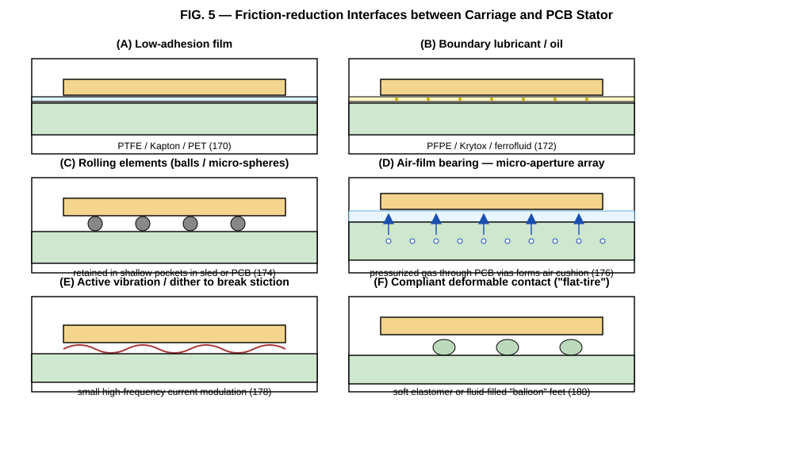

*FIG. 5 — Six friction-reduction interfaces between the carriage and the PCB stator.*

 

| Strategy | Mechanism | Friction | Cost | Complexity | PCB wear risk |
| :---- | :---- | :---- | :---- | :---- | :---- |
| PTFE / Delrin pads | Sliding (dry) | Low–medium | € | Very low | Medium (abrasive) |
| Silicone / rubber feet | Sliding (high grip) | High | € | Very low | Low |
| Kapton / PET film | Sacrificial layer | Low | € | Low | None (film takes wear) |
| PFPE / Krytox oil | Fluid film | Low | €€ | Medium | Low (if compatible) |
| Ferrofluid | Magnetic liquid | Very low | €€ | Medium | None |
| Hard micro-balls | Rolling (point) | Very low | € | Medium | High (denting) |
| Microsphere bed | Rolling (distributed) | Low | € | Medium | Medium |
| Compliant "balloon" feet | Deformable contact | Medium | €€€ | High | Low |
| Air-film bearing | Pressurised gas | Near zero | €€ | Very high | None |
| Active dither / vibration | Stiction breaking | Effective low | € | Low (firmware) | None |
| Glass/polished plate | Reduced friction | None | € | low (assembly) | None |

### **5.5.1 Air-film bearing embodiment**

In a particularly preferred embodiment, the PCB stator is provided with a distributed array of micro-apertures — for example small drilled holes, plated or unplated vias, milled slots, or laser-processed openings — through which a pressurised gas (typically clean dry air or nitrogen) is supplied so as to form a thin air film between the lower face of the carriage and the upper face of the PCB. The pressurised gas may be supplied from a manifold bonded to the underside of the PCB, from a sealed plenum formed by an additional layer of the PCB stack, or from individual gas inlets connected to selected zones of the PCB. The aperture array may be uniform or patterned; the gas supply may be globally regulated, zoned, or actively controlled in real time by valves so as to reduce gas consumption when the carriage is stationary or to increase support stiffness during fast moves. The same air supply may be exploited as a means of active cooling for the PCB stator and the drive electronics. The air-film bearing reduces friction to essentially zero, eliminates carriage wear on the PCB, and permits very fast settling and high-speed scanning. Its principal cost is the requirement for a pressurised gas supply.

### **5.5.2 Active dither and impulse compensation**

In any of the sliding-contact embodiments, stick-slip and stiction may be mitigated by superimposing a small high-frequency dither signal on the drive currents. The frequency, amplitude, and waveform of the dither may be selected based on a calibrated impulse response of the carriage, and may be adapted in real time according to the current direction of motion, the commanded velocity, and the measured residual error. Such adaptive feedforward compensation falls within the scope of the present disclosure.

## **5.6 Drive electronics and current control**

With reference to FIG. 8 and FIG. 9, in one embodiment the PCB stator is driven by a controller board comprising a microcontroller, a plurality of bipolar current-driver channels, an interface for a host computer or a higher-level controller, and a power-conversion stage. In a representative implementation, henceforth referred to as the "QuadDriver", the microcontroller is an STMicroelectronics STM32G474 (or any pin-compatible or functionally equivalent device); the bipolar current-driver channels are four in number; each channel comprises a half-bridge gate driver such as a Diodes Incorporated DGD0506A driving a pair of N-channel power MOSFETs such as the Vishay SI2318A in a full H-bridge configuration; each channel further comprises an output LC filter (in a representative implementation, a 22 µH inductor and a low-ESR ceramic capacitor) and a low-side current shunt (representatively 0.02 Ω) feeding an analog input of the microcontroller; the host interfaces are USB-C and CAN-FD (the latter via, for example, a Microchip MCP2542 transceiver); the input supply may be provided over USB-C or via a separate DC input; and an on-board boost regulator (for example a Texas Instruments TPS40210) generates a higher drive rail (typically 10 V to 24 V) from the input supply, while a low-dropout linear regulator generates the 3.3 V logic supply for the microcontroller and the CAN transceiver.

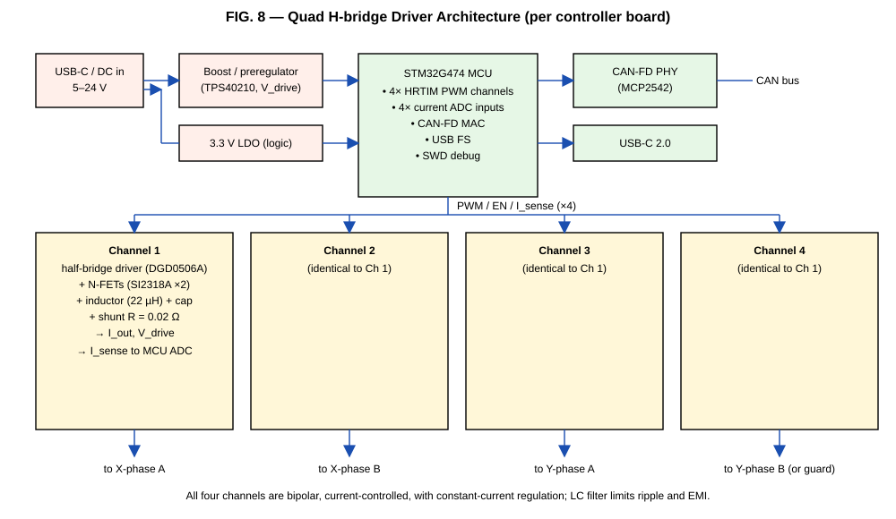

*FIG. 8 — Four-channel bipolar current-driver controller board (the "QuadDriver").*

*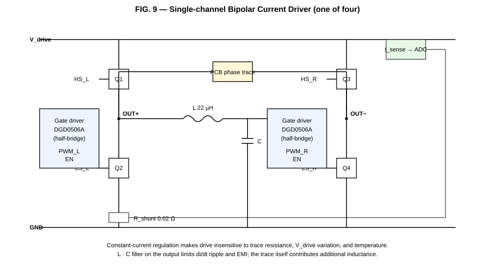*

*FIG. 9 — Single bipolar current-driver channel.*

Each channel implements constant-current regulation, that is, the microcontroller measures the instantaneous current in the channel via the shunt and adjusts the duty cycle of the gate-driver PWM so as to drive the measured current to a commanded set-point. Constant-current regulation makes the drive substantially insensitive to variations in trace resistance (which may differ between channels by an order of magnitude depending on PCB geometry), to variations in the drive supply voltage, and to changes in copper temperature during operation. The output LC filter limits the di/dt of the current waveform, reduces conducted and radiated EMI, and smooths the current ripple seen by the PCB-stator traces. The same controller board may be used to drive an X-phase pair on two of its four channels and a Y-phase pair on the other two channels; alternatively, two of the channels may drive an X- or Y-phase pair while the other two drive guard or auxiliary traces. Multiple QuadDriver boards may be cascaded over the CAN-FD bus to drive segmented PCB stators (see section 5.8 below).

The drive waveforms commanded by the microcontroller are not limited to simple sinusoidal commutation. The disclosure contemplates: full-step, half-step, and microstepped operation; analog sinusoidal drive synthesised by PWM; arbitrary current waveforms loaded from a host computer; calibrated impulse-response feedforward; superimposed dither for stick-slip mitigation; and pre-distortion to compensate for non-linearities of a particular PCB layout.

## **5.7 Position feedback and motion control**

With reference to FIG. 6, the stage may be operated either open-loop, in which case the controller commands a sequence of electrical angles in the manner of a stepper motor, or closed-loop, in which case the actual position of the carriage is measured and the controller drives the position error toward zero. In a particularly advantageous embodiment, the position feedback is obtained directly from images captured through the same microscope objective that is used to image the sample. Such image-based feedback may be implemented by tracking features on the sample itself, by tracking printed or machined fiducials on the carriage, by tracking a calibration pattern on the carriage, or by phase-correlating successive frames. Image-based feedback exploits hardware that is already present in the microscope and therefore adds essentially zero cost or weight to the stage.

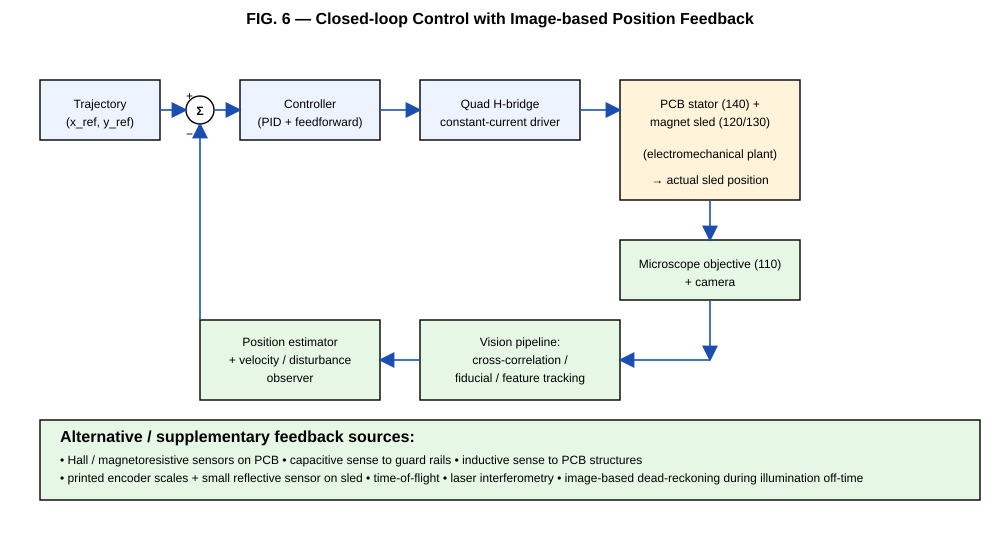

*FIG. 6 — Closed-loop control with image-based position feedback.*

The disclosure further contemplates, alone or in combination with image-based feedback, any one or more of the following position-feedback sources:

- dedicated optical encoders, including reflective or transmissive linear encoders with printed or laser-etched scale patterns (the scale may be printed directly on a layer of the PCB or on a separate film bonded to the PCB);

- Hall-effect or magnetoresistive sensors (TMR, GMR, AMR) mounted on the PCB stator and reading the field of the carriage magnet array;

- capacitive sensing between the carriage and dedicated reference electrodes patterned on the PCB stator;

- inductive sensing of the carriage position relative to printed coils or trace structures on the PCB;

- time-of-flight optical sensors mounted on the PCB stator;

- laser interferometry, where ultra-high precision is required;

- any combination of the above with sensor fusion in the microcontroller or in a host computer.

The motion-control firmware contemplated by the disclosure supports raster scanning, serpentine (boustrophedon) scanning, point-to-point trajectories defined by lists of (x, y) coordinates with associated dwell times, continuous scanning with hardware-synchronised camera triggering, and arbitrary trajectories generated by a host application. The controller may apply calibrated impulse-response compensation, adaptive feedforward based on direction and velocity, and learning-based correction of repeatable trajectory errors.

## **5.8 Homing, referencing, and segmentation**

A home or absolute reference position may be defined in any of several ways: by a mechanical end-stop formed by the shape of the sled or by a feature on the PCB; by one or more printed fiducials detected optically through the microscope or through a dedicated sensor; by an embedded optical interrupter or Hall sensor; or by a region of the PCB stator in which the trace geometry has been deliberately made distinctive so as to produce a recognisable signature in the carriage current or in a position sensor when the carriage passes over it.

With reference to FIG. 7, the active area of the PCB stator may be partitioned into a plurality of electrically independent segments, also referred to as tiles, each of which is independently drivable by its own current-driver channels or by its own QuadDriver-equivalent controller. A higher-level controller energises only the tile or tiles that are currently under the carriage, or in the immediate path of the carriage, while leaving all other tiles unenergised. This dramatically reduces the total drive power required for any given travel area, and it permits the active area to be scaled to essentially arbitrary size simply by tiling additional segments. Tiles may be implemented as separate physical PCBs joined edge-to-edge, as electrically independent regions of a single larger PCB, or as a hybrid of both. Tiles may communicate over a multi-drop bus such as CAN-FD, RS-485, or Ethernet.

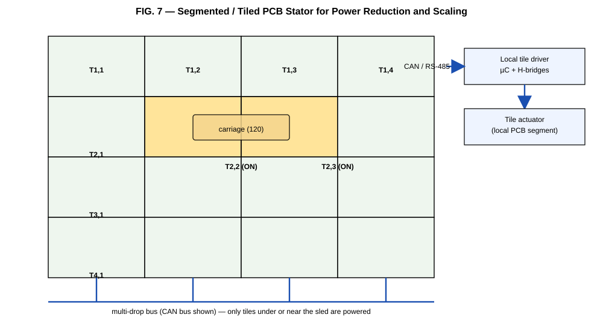

*FIG. 7 — Segmented / tiled PCB stator with per-tile drivers on a multi-drop bus.*

## **5.9 Application examples**

With reference to FIG. 10, the same PCB stator may be reconfigured for a wide range of microscopy applications merely by changing the carriage adapter that holds the sample. Examples expressly contemplated by the disclosure include:

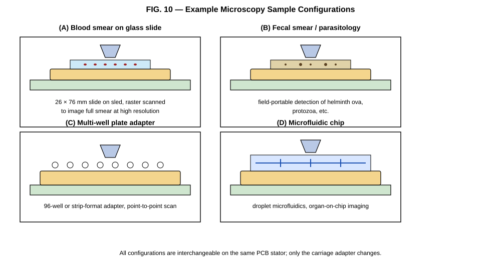

*FIG. 10 — Representative microscopy sample configurations.*

- whole-slide imaging of stained blood smears for haematology, malaria diagnosis, and other parasitology applications;

- imaging of fecal smears for soil-transmitted helminth and protozoan diagnosis in low-resource and field settings;

- automated screening of multi-well plates (24-, 96-, 384-well, and strip formats) for cell biology, drug discovery, and assay development;

- imaging of microfluidic chips, droplet microfluidics, organ-on-chip devices, and lab-on-chip systems;

- histopathology, cytology, and tissue-section imaging;

- automated sperm motility analysis;

- field-portable diagnostic instruments operated from battery power;

- embedded microscopes for incubators, biosafety cabinets, and other space-constrained environments;

- any other microscopy application requiring fast, repeatable, low-cost XY translation of a sample over a planar field.

 

# **6\. Example Embodiments (non-limiting)**

The following non-limiting example embodiments are provided to illustrate the breadth of the disclosure. Any combination of features from different embodiments is also expressly contemplated.

## **6.1 Embodiment A — Basic four-layer slide-imaging stage**

A four-layer FR-4 PCB stator approximately 100 × 100 mm in extent, with X-phase traces on the top conductive layer, Y-phase traces on the second conductive layer, control routing on the third conductive layer, and a ground/shield plane on the fourth conductive layer. A central 25 × 25 mm rectangular aperture passes transmitted illumination. The carriage is a 3D-printed sled approximately 30 × 30 × 5 mm carrying eight NdFeB N52 magnets in a linear Halbach array, sized to hold a standard 26 × 76 mm microscope slide. The friction interface is a single layer of 25 µm PET film bonded to the upper face of the PCB. A single QuadDriver board drives the X- and Y-phase pairs from its four channels. Position feedback is obtained by phase-correlating successive 2 MP frames captured through a 4× objective at a frame rate of 30 fps.

## **6.2 Embodiment B — Segmented air-bearing stage for whole-plate imaging**

A 2 × 3 array of independently driven 100 × 100 mm PCB tiles forming a 200 × 300 mm active area, with each tile carrying its own QuadDriver-equivalent controller and communicating over CAN-FD with a host. Each tile incorporates a uniform array of 0.5 mm vias on a 5 mm pitch, fed from a manifold bonded to the underside of the tile and supplied with clean dry air at approximately 0.3 bar to form an air-film bearing. A single carriage carries a 96-well-plate adapter and a 2D Halbach magnet array on a √2-pitch grid rotated 45° relative to the trace grid. Imaging is from below through a long-working-distance 10× objective; epi-illumination is provided by an LED ring mounted on the PCB above the imaging aperture.

## **6.3 Embodiment C — Inverted fluorescence stage with carriage telemetry**

A six-layer PCB stator with a central 15 mm circular aperture for an inverted fluorescence objective. The carriage carries, in addition to the magnet array, a small inductive coupling coil that picks up power from a coil pattern on the PCB stator and uses it to drive a temperature sensor and a small RGB LED used as a position fiducial. Position feedback is provided by tracking the RGB fiducial in the brightfield channel of the camera while the fluorescence excitation is gated off. A single QuadDriver board provides drive; a second QuadDriver board, daisy-chained over CAN-FD, drives auxiliary guard traces for centring during fast scans.

## **6.4 Embodiment D — Field-portable diagnostic instrument**

A battery-powered handheld microscope incorporating a single 80 × 80 mm PCB stator, a single QuadDriver board, an integrated Raspberry-Pi-class single-board computer with a CSI camera, and a slide-loading mechanism. The carriage uses Kapton-film friction reduction with active dither in the firmware. Total instrument cost target: less than €300 in single-unit volumes; weight less than 1 kg; battery life sufficient for a full clinic-day of operation.

 

# **7\. Combinatorial Variant Matrix**

For the avoidance of any doubt, and to make explicit the very large combinatorial space that is the subject of this disclosure, Table 7-1 below tabulates the principal axes of variation contemplated by the present disclosure. Any combination of one selection from each row is hereby disclosed as an embodiment.

 

| Axis of variation | Variants disclosed |
| :---- | :---- |
| PCB layer count | 2, 4, 6, 8, or more layers |
| Number of phases per axis | 2, 3, 4, or more |
| Drive scheme | Full-step, half-step, microstepped, sinusoidal, arbitrary |
| Magnet arrangement | Single magnet, alternating array, linear Halbach, 2D Halbach on √2 grid, electromagnet |
| Magnet material | NdFeB (any grade), SmCo, bonded ferrite |
| Friction interface | PTFE pad, Delrin pad, silicone, Kapton/PET film, oil/PFPE, ferrofluid, micro-balls, microsphere bed, compliant feet, air bearing, dither-only |
| Aperture geometry | None, single circular, single rectangular, multiple, ring, slot, transparent window |
| Optical configuration | Upright trans, inverted trans, epi-fluorescence, darkfield, oblique, hybrid |
| On-board illumination | None, LED ring, single LED, laser diode, VCSEL, fluorescent silkscreen |
| Position feedback | None (open-loop), image-based, optical encoder, Hall, MR (TMR/GMR/AMR), capacitive, inductive, ToF, interferometric, fused |
| Stator topology | Monolithic, segmented tiles, hybrid |
| Controller interface | USB-C, CAN-FD, RS-485, Ethernet, Wi-Fi, Bluetooth |
| Carriage extras | None, inductive power, telemetry radio, on-board LED/laser, temperature control, fiducials, scale bars |
| Sample format | Slide, coverslip, multi-well plate (24/96/384), microfluidic chip, Petri dish, capillary, custom adapter |
| Application domain | Haematology, parasitology, histopathology, cytology, cell biology, drug discovery, microfluidics, organ-on-chip, sperm analysis, field diagnostics, embedded incubator microscopy |

   
*Table 7-1: Combinatorial variant matrix. Any combination of one or more selections from each row, with any combination from any other row, is expressly disclosed.*

 

# **8\. Implementation Details Intentionally Omitted**

This document is intended to publish the conceptual and architectural subject matter described in sections 3 through 7, so as to make that subject matter prior art and thereby prevent third-party patents on it. It is not, and is not intended to be, a complete manufacturing recipe. The authors have intentionally not disclosed the following classes of information in this document:

- the specific trace pitches, widths, copper thicknesses, and via patterns used in the authors' own working prototypes;

- the specific PWM frequencies, current set-points, dither parameters, and commutation tables loaded into the QuadDriver firmware in the authors' own deployments;

- the calibration procedures, look-up tables, and per-PCB correction maps used to compensate for manufacturing variation in the authors' own deployments;

- the specific image-processing pipeline, feature detector, registration algorithm, and control gains used by the authors' image-based feedback loop;

- the air-flow rates, plenum geometries, and zoning patterns used in the authors' air-bearing prototypes;

- the specific Halbach magnet sourcing, magnetisation tooling, gluing fixtures, and assembly jigs used by the authors;

- the host-side software stack used to operate the authors' instruments.

These items are excluded for two reasons. First, none of them is necessary to disclose the underlying invention; the routine engineer skilled in the relevant art can, given the present disclosure, arrive at workable values for each of them by ordinary experimentation. Second, the authors and the openUC2 community wish to retain the practical know-how that makes their own implementations work well, so that third parties who wish to obtain a turnkey working system have an incentive to collaborate with the authors rather than to copy and undercut them. The authors emphasise that the absence of these items from this document does NOT in any way limit the scope of the prior art that this document creates. Anything obvious to the person of ordinary skill in the art from the conceptual disclosure in sections 3 through 7 is, by operation of patent law in the relevant jurisdictions, also part of the prior art created by this publication.

 

# **9\. Numbered Embodiment Statements**

The following numbered statements are provided in claim-style format. They are not legal claims, because this document is a defensive publication and not a patent application. Their purpose is to set out, in the precise and structured language used by patent examiners, a comprehensive set of embodiments that the authors intend to enter the public domain on the publication date of this document. Any third party who later attempts to claim subject matter falling within any of the following statements should be confronted with this publication as prior art.

## **9.1 Independent embodiment statements**

1\. 	An XY translation stage for optical microscopy, comprising: a planar substrate comprising a printed circuit board having a plurality of conductive layers and patterned copper traces on at least two of the conductive layers, the patterned copper traces being configured to generate, when supplied with currents, a controllable in-plane magnetic field distribution; a carriage configured to support a microscopy sample; a magnet assembly mechanically coupled to the carriage and arranged to interact with the magnetic field distribution generated by the patterned copper traces such that the carriage is translated in an X direction and in a Y direction within a plane parallel to the printed circuit board; and an optical detection system comprising a microscope objective arranged to image the microscopy sample while the carriage is translated relative to the microscope objective.

2\. 	An XY translation stage according to statement 1, wherein the patterned copper traces comprise an X-axis first phase trace set, an X-axis second phase trace set spatially offset from the X-axis first phase trace set, a Y-axis first phase trace set, and a Y-axis second phase trace set spatially offset from the Y-axis first phase trace set, the four trace sets being arranged on at least two different conductive layers of the printed circuit board, and configured to be driven with phase-shifted currents so as to produce traveling magnetic fields in both the X and Y directions.

3\. 	An XY translation stage according to statement 1, wherein the printed circuit board further comprises at least one optical aperture passing through all conductive layers of the printed circuit board, the at least one optical aperture being arranged to permit one or more of: transmitted illumination from a side of the printed circuit board opposite to the carriage; epi-illumination on the same side as the microscope objective; fluorescence excitation; and inverted imaging.

4\. 	An XY translation stage according to statement 1, further comprising a feedback controller configured to estimate a position of the carriage from one or more images captured through the microscope objective, and to control the currents in the patterned copper traces based on the estimated position.

5\. 	An XY translation stage according to statement 1, wherein the printed circuit board is partitioned into a plurality of electrically independent tile segments each having its own current-driver electronics, and wherein a higher-level controller selectively energises only the tile segment or segments that are under or adjacent to the carriage.

6\. 	An XY translation stage according to statement 1, wherein the printed circuit board further comprises a distributed array of micro-apertures arranged to emit a pressurised gas so as to form an air film between the carriage and the printed circuit board.

## **9.2 Dependent embodiment statements**

7\. 	The XY translation stage of statement 1, wherein the printed circuit board is a four-layer printed circuit board and at least one of the patterned copper trace sets is positioned within 0.5 mm of the surface of the printed circuit board that faces the magnet assembly.

8\. 	The XY translation stage of statement 1, wherein the magnet assembly comprises permanent magnets arranged in a Halbach configuration, with the strong side of the Halbach configuration facing the printed circuit board.

9\. 	The XY translation stage of statement 1, wherein the magnet assembly comprises a two-dimensional array of permanent magnets, the spacing of which is set to √2 times the pitch of the patterned copper traces, the two-dimensional array being rotated by approximately 45° relative to the orientation of the patterned copper traces.

10\.  The XY translation stage of statement 1, wherein the magnet assembly comprises one or more electromagnets that are powered by an inductive coupling element on the carriage and a corresponding inductive coupling element on the printed circuit board.

11\.  The XY translation stage of statement 1, further comprising one or more guard trace sets disposed laterally with respect to a nominal path of the carriage and configured to generate a restoring force biasing the carriage toward a centreline.

12\.  The XY translation stage of statement 11, wherein the current in the one or more guard trace sets is determined by the feedback controller as a function of a measured lateral displacement of the carriage.

13\.  The XY translation stage of statement 1, wherein the carriage interfaces with the printed circuit board through one or more of: a low-adhesion polymer film; a fluorinated polymer film; a dry lubricant; a fluid lubricant; a ferrofluid; rolling balls; a bed of microspheres; compliant deformable feet; or an air-film bearing.

14\.  The XY translation stage of statement 1, further comprising bidirectional constant-current drivers configured to drive the patterned copper traces.

15\.  The XY translation stage of statement 14, wherein the constant-current drivers are organised as four channels on a single controller board, the controller board further comprising a microcontroller and digital/analog input/ouput interfaces to drive a segmented PCB stator.

16\.  The XY translation stage of statement 1, further comprising a homing feature defining a reference position by means of one or more of: a mechanical end-stop formed by the shape of the carriage; an optical fiducial printed on the printed circuit board; an embedded Hall sensor; an embedded optical interrupter; or a region of the patterned copper traces having a deliberately distinctive geometry.

17\.  The XY translation stage of statement 1, wherein the carriage further comprises one or more of: an inductive power-receiver coil; a wireless data transceiver; an integrated illumination element; a printed or machined fiducial pattern; an active temperature-control element; or a battery.

18\.  The XY translation stage of statement 1, wherein the printed circuit board further comprises one or more of: surface-mounted illumination LEDs; surface-mounted laser diodes; a fluorescent or scintillating coating on the silkscreen layer; or surface-mounted photodetectors.

19\.  The XY translation stage of statement 4, wherein the feedback controller is further configured to apply calibrated impulse-response feedforward, adaptive feedforward as a function of direction and velocity, and/or a high-frequency dither superimposed on the drive currents, so as to mitigate stick-slip and reduce settling time.

20\.  The XY translation stage of statement 1, wherein the controller is configured to execute one or more of: a raster scan; a serpentine scan; a point-to-point trajectory defined by a list of (x, y) coordinates with associated dwell times; or a continuous trajectory with hardware-synchronised camera triggering.

21\.  A microscopy instrument comprising the XY translation stage of any one of statements 1 to 20, an illuminator, a camera, and a host computer programmed to execute whole-slide imaging, multi-well plate scanning, or microfluidic chip imaging using image-based closed-loop position feedback through the microscope objective.

 

 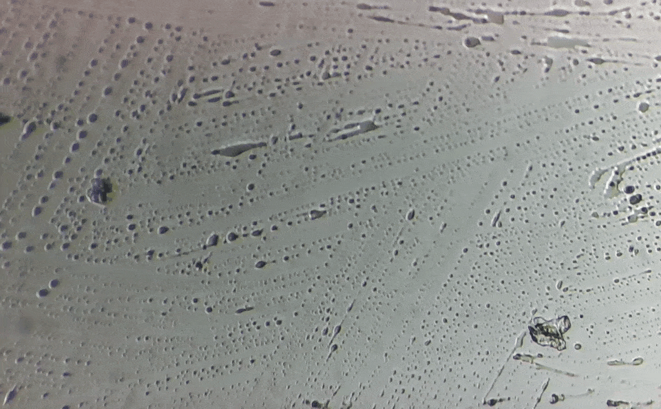
 *Example of a 2D scan of a coverslip using the prototype instrument, with a 10× objective and a 2 MP camera. The scan covers an area of approximately 5 × 5 mm, with a step size of 50 µm and a dwell time of 100 ms per step.* 

 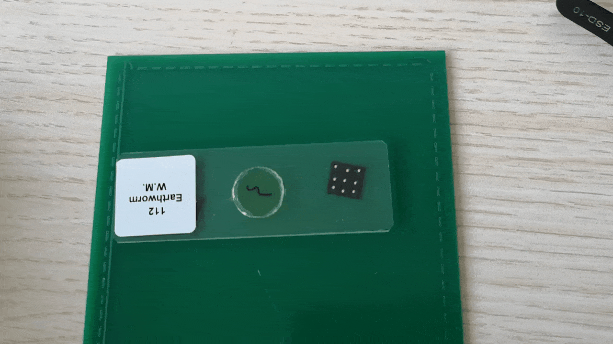 
 *Example of roller-based friction reduction using a bed of 0.5 mm diameter micro-balls hold in a cage sandwidched between two glass plates.*

 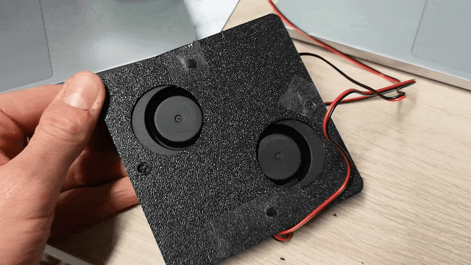 
 *Example of an "air hockey" style air-film bearing, in which a uniform array of 0.5 mm diameter vias on a PCB tile emits a flow of clean dry air to support the carriage on a thin film of "gas"/air.*

 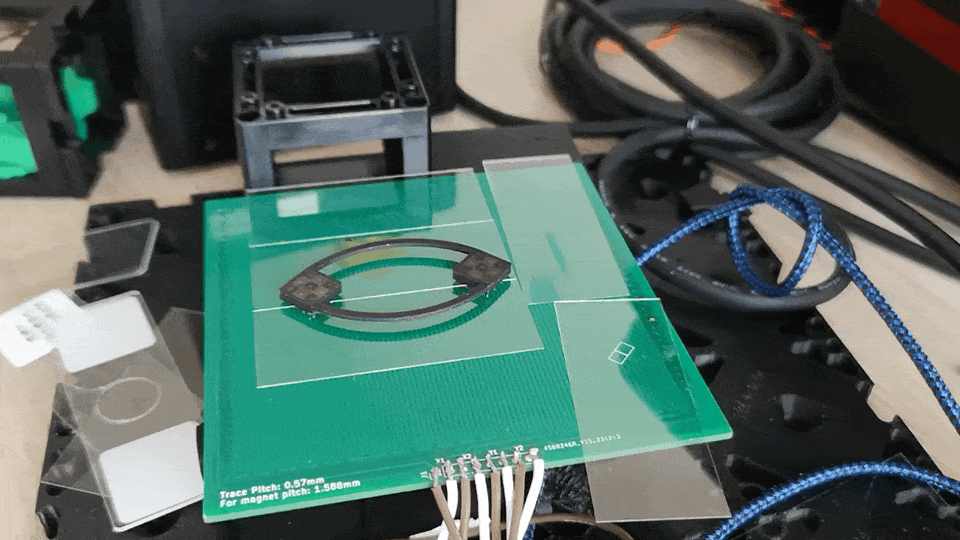 
 *Example of a friction-reduced strategy where the magnets glide over a flat piece of thin glass or polished plate, with no additional friction-reduction interface; the PCB stator is driven with a high-frequency dither to break stiction and achieve smooth motion.*

 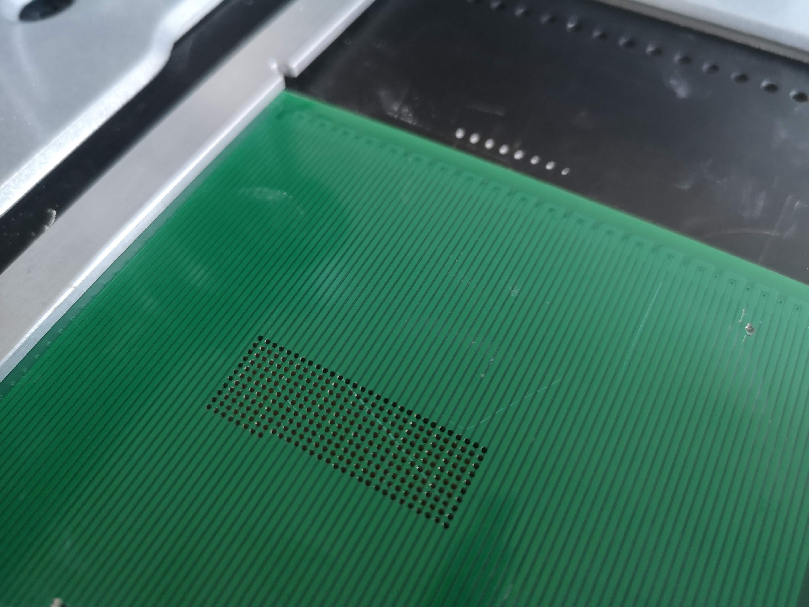 
 *Example of holes in a pcb between traces to allow light through for transmitted illumination; the holes may be drilled, milled, laser-processed, or implemented as plated or unplated vias. They also act as air outlets for an air-film bearing.*

 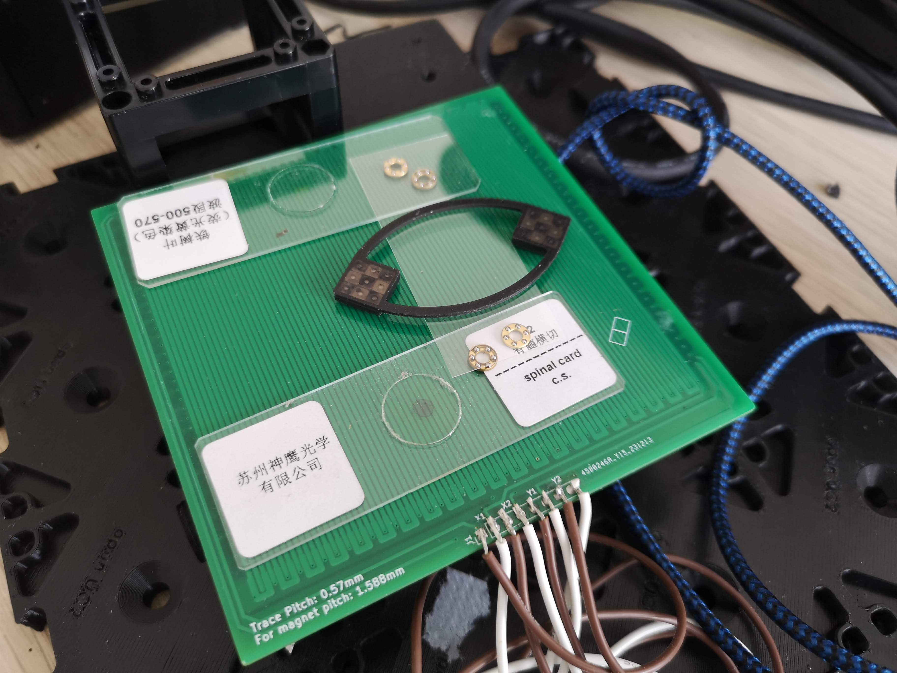 
 *Example of special bearings for the carriage, in this case a bed of 0.5 mm diameter micro-balls held in a cage sandwiched between two glass plates, which allows the carriage to glide with very low friction over the PCB stator.*

 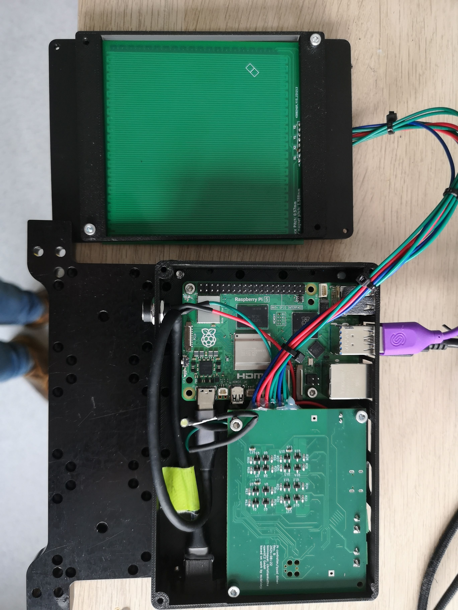 
 *Example of the assembly including the driver, the controlling computer and the PCB stator with the carriage on top. The microscope objective is not yet in place in this photograph.*

 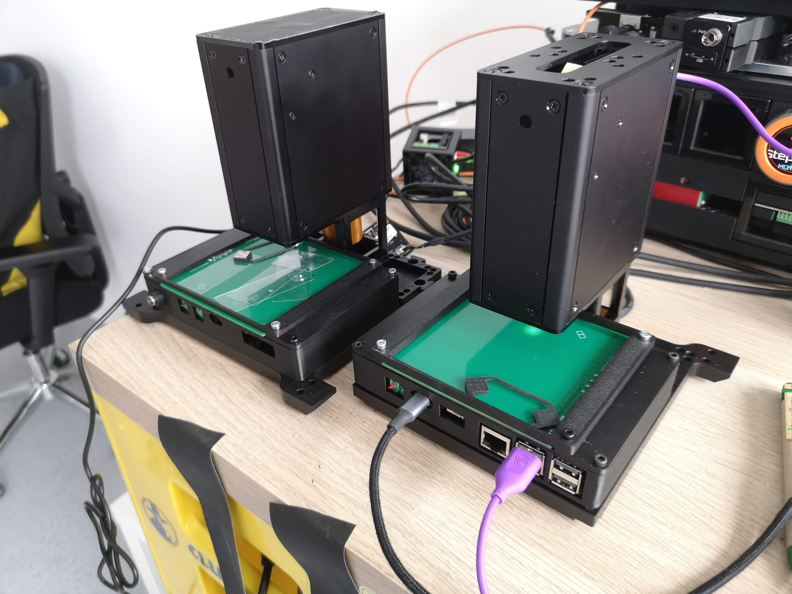
 *Example of the assembled instrument with the microscope objective in place. The carriage is visible as a black square on top of the PCB stator, which is mounted horizontally on the stage.*

# **10\. Items Required for Complete Coverage of the Current Implementation**

For the present document to fully cover, as prior art, the authors' current working implementation, the following materials should be added in subsequent revisions before final publication. The authors flag these explicitly so that the document can be completed without ambiguity.

- Photographs of the working prototype: at least one top-down photograph of the PCB stator with the sled in place; at least one photograph of the underside of the PCB showing the controller mounting; at least one photograph of the complete instrument with the microscope objective in position.

- Captured microscope images obtained with the prototype: at least one example brightfield image, one transmission image, one epi-illumination/fluorescence image, and one stitched whole-slide mosaic, each with a scale bar and an indication of the objective and camera used.

- A KiCad export of the QuadDriver schematic and PCB layout, or a clearly licensed link to the openUC2 GitHub repository in which they live, so that the document anchors the schematic disclosure of section 5.6 to a verifiable artefact with a publication date.

- A short, high-level description of the firmware running on the STM32G474, sufficient to establish that closed-loop, image-based, microstepped operation has actually been demonstrated. (Code listings are not required.)

- A short, high-level description of the host-side software used to drive the prototype (for example, the openUC2 ImSwitch integration), again sufficient to establish actual reduction to practice without disclosing implementation know-how that the authors wish to retain.

- A measured force-vs-current curve, a measured step-response, or any other quantitative performance datum that the authors are willing to publish; even one such curve substantially strengthens the prior-art value of the document.

- A clean BOM of the QuadDriver board (the schematic already implies most of it; an explicit BOM removes any ambiguity about which components are claimed as part of the disclosure).

- Confirmation of the licensing terms for the document text (the authors propose CC BY 4.0), for the figures (same), and for the associated hardware design files (the authors should confirm CERN-OHL-S, CERN-OHL-W, or another open hardware licence as appropriate to openUC2 GmbH policy).

- Confirmation of the author list and affiliations, and an ORCID iD for each author if available, so that the Zenodo deposit and any DOI minted from it carry full bibliographic metadata.

- A DOI placeholder section for the final published version, to be filled in once the Zenodo deposit is made.

 
 

# **12\. References and Acknowledgements**

The authors gratefully acknowledge the prior public work of:

- Kevin Lynagh, "PCB Stepper" (2022), https://kevinlynagh.com/pcb-stepper/

- Jeff McBride, "The Gauss Speedway" (November 2022), https://jeffmcbride.net/gauss-speedway/

- Jeff McBride, "KiCad Magnet Racetrack Layout with Python Plugin" (2022), https://jeffmcbride.net/kicad-track-layout/

- Jeff McBride, "CurvyCad" (open-source software), https://github.com/mcbridejc/curvycad

- Jeff McBride, "GaussSpeedway" hardware design files, https://github.com/mcbridejc/GaussSpeedway

- Jeff McBride, "speedway-controller" firmware, https://github.com/mcbridejc/speedway-controller

- The openUC2 community and openUC2 GmbH, https://openuc2.com/

The QuadDriver controller board described in section 5.6 and FIG. 8 / FIG. 9 was designed by Jeff McBride. The KiCad source files for the QuadDriver are intended to be released under an appropriate open-hardware licence in conjunction with this defensive publication.

# **13\. Licence**

The text and figures of this document are released by the authors under the Creative Commons Attribution 4.0 International (CC BY 4.0) licence. The full text of the licence is available at https://creativecommons.org/licenses/by/4.0/. Any third party is free to copy, redistribute, and adapt this document, including for commercial purposes, provided that appropriate credit is given, a link to the licence is provided, and any changes are indicated. Hardware design files, firmware, and host software referenced in this document are released separately under their respective open-source licences as published by the private person or openUC2 GmbH on its public repositories; nothing in this document grants any licence to any patent owned or controlled by the authors or by openUC2 GmbH.

